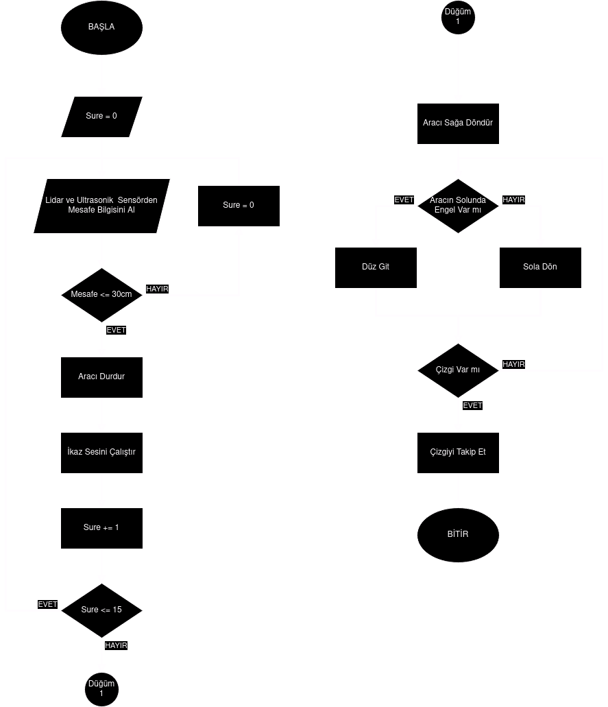
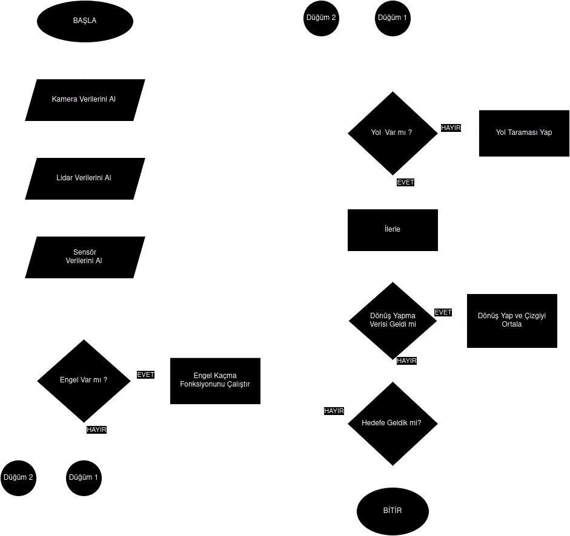
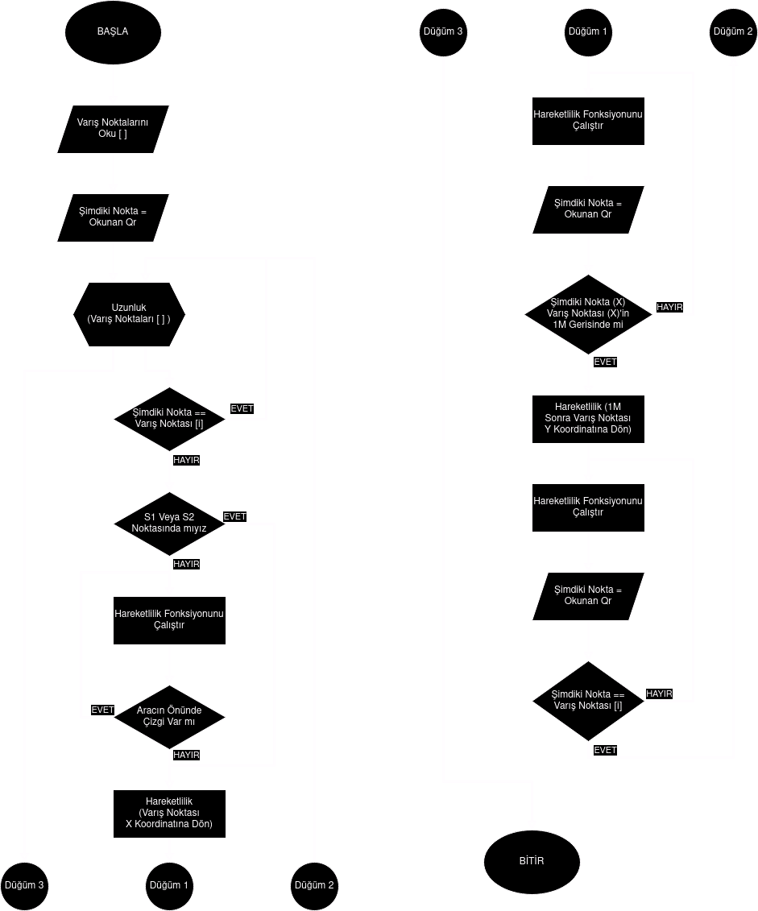

# Astronik 81 Yazılım

Bu proje, **TEKNOFEST Sanayide Dijital Teknolojiler Yarışması** için geliştirilen *Otonom Güdümlü Araç* yazılımlarını içerir. Yazılım, aracın otonom kontrolü, güdümü, navigasyonu ve veri görselleştirme işlemlerini gerçekleştirmek üzere tasarlanmıştır.

## Özellikler

- **Otonom Kontrol**: Araç, çevresel verileri işleyerek bağımsız hareket edebilir.
- **Engelden Kaçınma Algoritması**: LiDAR ve ultrasonik sensörlerden gelen verilerle engellerden kaçma.
- **Şerit Takip ve QR Kod İşleme**: Kamera görüntülerinden şeritleri takip ederek parkur navigasyonu sağlar.
- **Veri Görselleştirme**: UDP/IP protokolü ile kontrol arayüzüne veri aktarımı.
- **ROS2 Tabanlı Modüler Sistem**: Yazılım, ROS2 tabanlı düğümlerle çalışır, bu sayede hareket, algı ve kontrol işlemleri bağımsız ve modüler şekilde gerçekleştirilir.
- **Veri Tabanı**: Microsoft SQL Server kullanılarak veri kaydı ve işleme.

## Teknolojiler ve Diller

- **Raspberry Pi 4**: Veri işleme ve sensör entegrasyonu için.
- **Deneyap Kart**: Sensörlerden veri alımı ve motor kontrolü.
- **LiDAR ve Ultrasonik Sensörler**: Çevresel tarama ve engel algılama.
- **Görüntü İşleme**: OpenCV ile çizgi ve QR kod takibi.
- **ROS2**: Modüler yazılım mimarisi için.
- **Veritabanı**: Microsoft SQL Server.
- **Programlama Dilleri**:
  - C++: ROS2 düğümleri ve Raspberry Pi yazılımı.
  - Python: Algoritmalar ve hızlı prototipleme.
  - C: Deneyap Kartı için sensör ve motor kontrolü.
  - C# (.Net Core): Veri görselleştirme ve kontrol arayüzü.

## Gereksinimler

- **Yazılım Ortamı**:
  - ROS2 Foxy Fitzroy veya üstü
  - Python 3.x (Raspberry Pi için)
  - Visual Studio (C# geliştirme için)
  - GCC veya ARM Toolchain (Deneyap Kart programlama için)
- **Kütüphaneler**:
  - OpenCV
  - ROS2 rclcpp, rclpy
  - SimpleCV
  - CanBus (Raspberry Pi ve Deneyap Kart arasında iletişim)
- **Donanımlar**:
  - Raspberry Pi 4
  - Deneyap Kart
  - LiDAR, Ultrasonik Sensörler, Kamera
  - Hub Motorlar ve Sürücüleri

## Kurulum

1. **Depoyu Klonlayın**:
    ```
    git clone https://github.com/B1ack-D3ath/Astronik-81.git
    cd Astronik-81
    ```

2. **ROS2 Kurulumu**:
    - **Ubuntu** için ROS2 Foxy Fitzroy yükleyin:
      ```
      sudo apt update
      sudo apt install ros-foxy-desktop
      ```
    - ROS2 düğümlerini kurun ve çalışma alanını oluşturun:
      ```
      colcon build
      source install/setup.bash
      ```

3. **Diğer Kurulumlar**:
    - **Raspberry Pi**:
      - Python kütüphanelerini yükleyin:
        ```
        pip install opencv-python simplecv
        ```
    - **Deneyap Kart**:
      - Geliştirme ortamını kurun (ARM GCC Toolchain).
      - Kart üzerindeki kodu derleyip yükleyin.
    - **Kontrol Arayüzü**:
      - Visual Studio kullanarak `ControlPanel.sln` dosyasını açın.
      - Derleme işlemini tamamlayın.

## Kullanım

1. ROS2 düğümlerini başlatın:
    ```
    ros2 launch astronik81_control control.launch.py
    ```
2. Raspberry Pi'ı çalıştırın ve sensörlerin düzgün şekilde bağlandığından emin olun.
3. Deneyap Kart ve diğer bileşenlerin enerjisini sağlayın.
4. Kontrol arayüzünü başlatın ve araç ile aynı ağa bağlanın.
5. Aracı "Manuel Kontrol" modunda test edin.
6. "Otonom Mod" seçeneğini kullanarak aracı bağımsız çalıştırın.

## Ek Görseller

- **ROS2 Düğüm Yapısı ve Bağlantı Şeması**
- <div style="display: flex; justify-content: space-around;">
    
</div>
- **Engelden Kaçınma Algoritması Akış Şeması**
<div style="display: flex; justify-content: space-around;">
    
</div>
- **Hareketlilik ve Navigasyon Algoritması Şeması**
<div style="display: flex; justify-content: space-around;">
    
</div>
